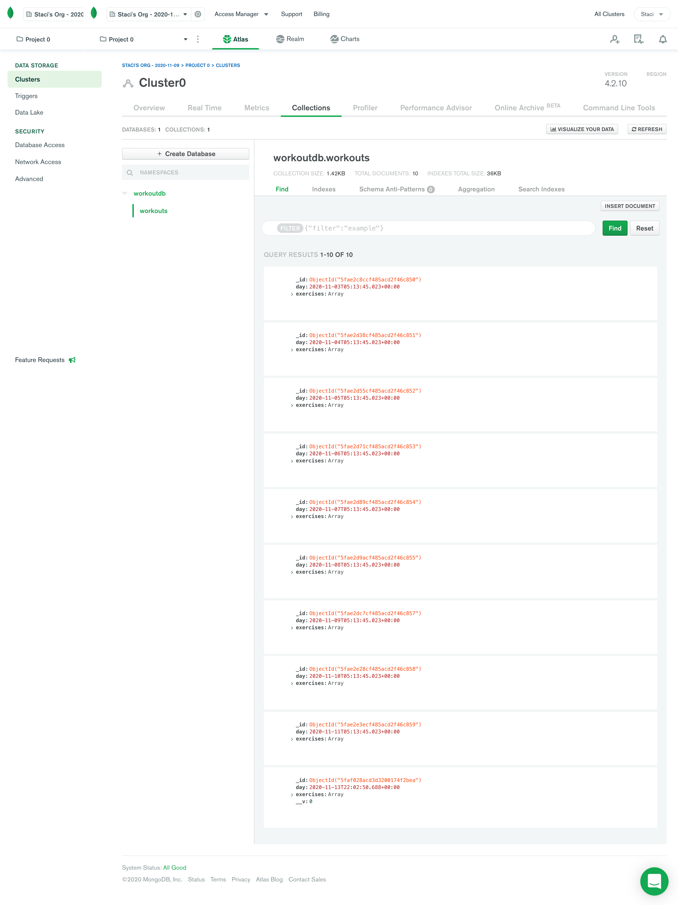

# Workout Tracker  

### Description
A app for consumers to track their workout progress to reach their fitness goals.

## Table of contents
* [Description](#Description)
* [Version](#Version)
* [Deployed Project](#Deployed)
* [Features](#Features)
* [Installation](#Installation)
* [Usage](#Usage)
* [Test](#Test)
* [Contributors](#Contributors)
* [Questions](#Questions)
* [License](#License)

### Version 
1.0.0

### Deployed Project
https://workout-tracker-20.herokuapp.com/

### Features
* Node.js
* MongoDB Cloud Atlas

## Installation
go to the deployed link below or git clone the whole repo to run the app locally.

## Usage

    npm i 

to install all packages and initalize, then 

    npm run watch

## Contributors
s2hon

## Questions
Follow me on GitHub:  
Ask me anything: staci.shon@gmail.com  

## License
MIT © Staci Shon 